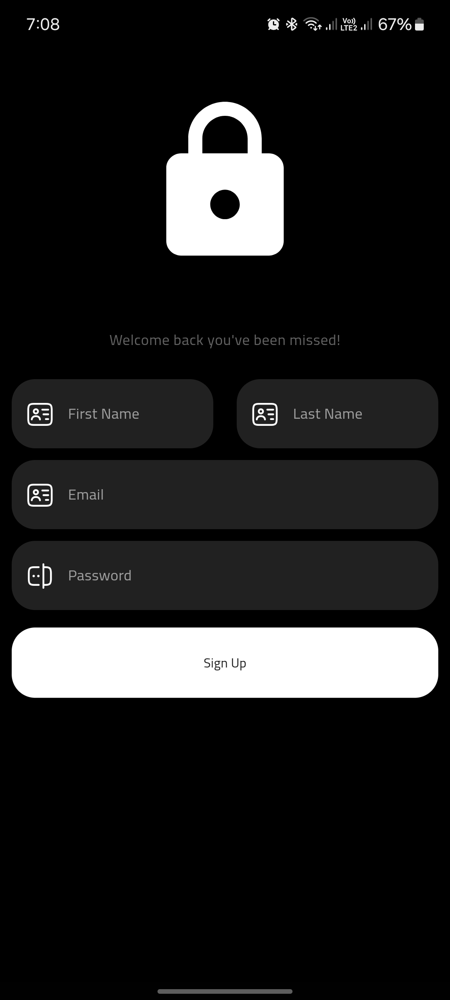
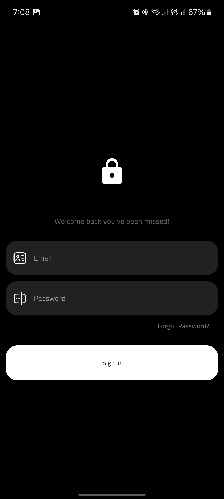
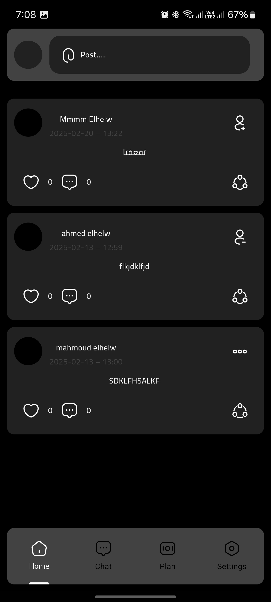
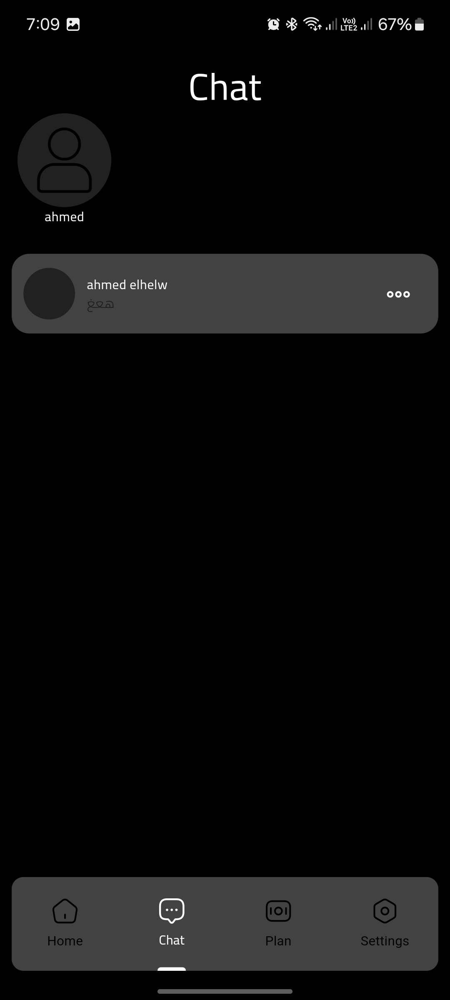
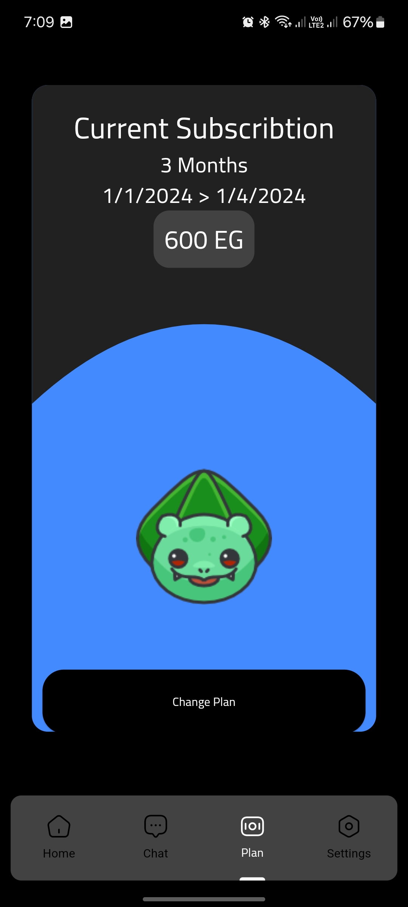
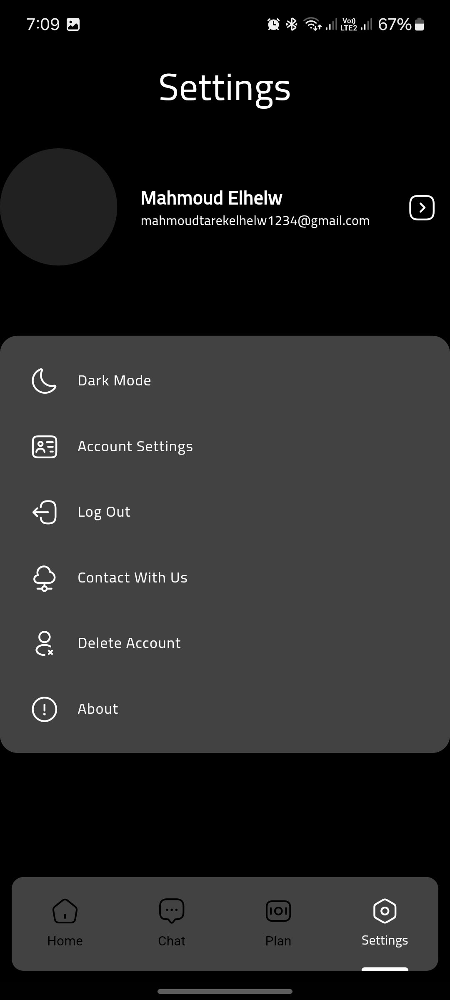

# 💪 SocialGym - Fitness Community Platform  

 

**All-in-one gym management app combining social features, messaging, and membership control.**  

  

## 🚀 Key Features  

### 1. **Social Feed (Facebook-style)**  
- 📸 Post videos/images/text  
- ❤️ Like/comment system  
- 🏷️ Tag friends in posts  
- 🔄 Real-time updates  

### 2. **Gym Messenger**  
- 💬 1-on-1 and group chats  
- 📲 Push notifications  
- 🏋️♂️ Gym-specific stickers  

### 3. **Subscription Management**  
- 💳 Plan comparison  
- 📅 Renewal reminders  
- 🏆 Member tier benefits  

### 4. **Account Settings**  
- 👤 Profile customization  
- ⚙️ Notification controls  
- 🚨 Emergency contact setup  

## 🛠️ Tech Stack  

| Layer               | Technology           |
|---------------------|----------------------|
| **Frontend**        | Flutter (Material 3) |
| **Backend**         | Firebase             |
| **State Management**| GetX                 |
| **Database**        | Firestore,Supabase   |
| **Auth**            | Firebase Auth        |

## 📱 Screenshots  

  
  
  
  
  
  
  

